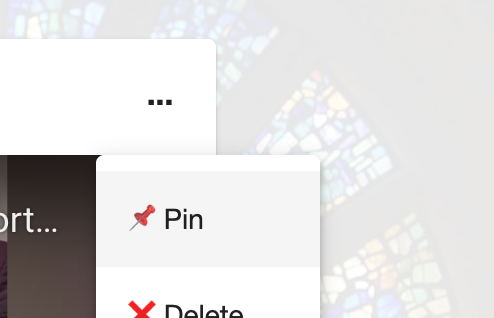
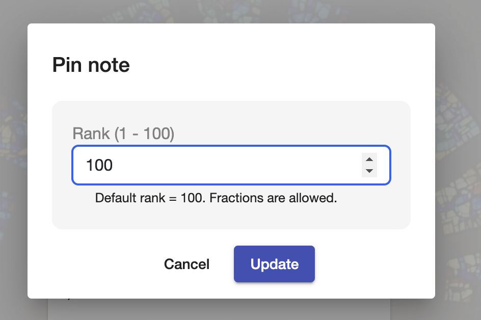
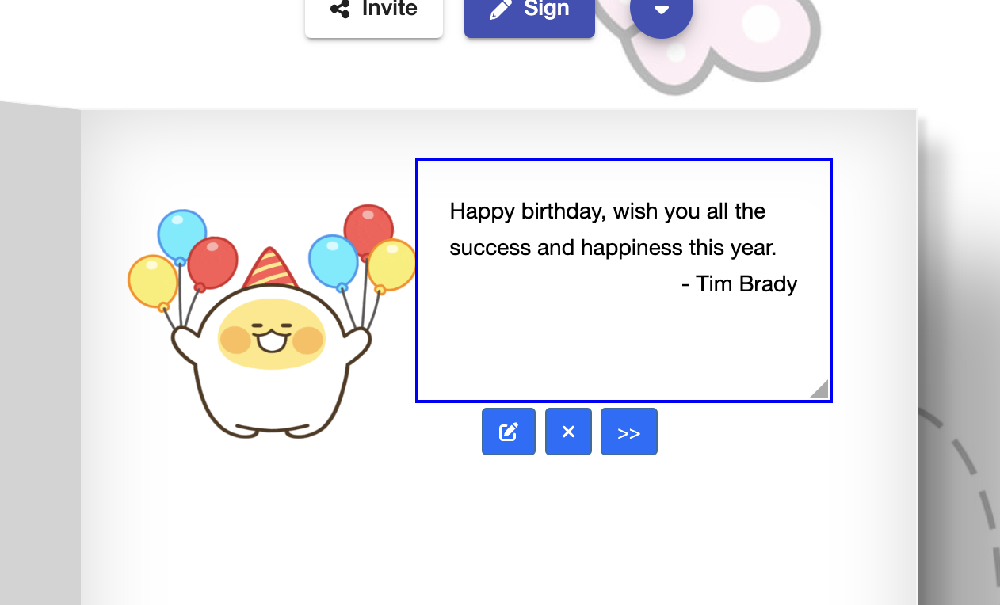
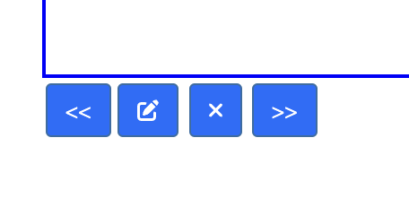

# Board: Order / Arrange messages

So there is a special message you want to put at the top of your board? Or you like messages sorted your way? 

With pins, you can do exactly that. Just click on the top right of a message -> then click on Pin.

Pinned messages can be ranked, e.g. 1-10. The default rank of a message is 100, allowing you to put any messages at the top or bottom, whatever way you like.

That's it for boards!

## Who can pin a message?

Only the board creator.

# Greeting Card: Arrange messages

Greeting cards are easy - just click a message, drag and drop.

You can also move a message to the previous or next pages, with << and >> buttons:

## Who can move messages?

- The card creator can move any messages.
- The message creator can also move their message.