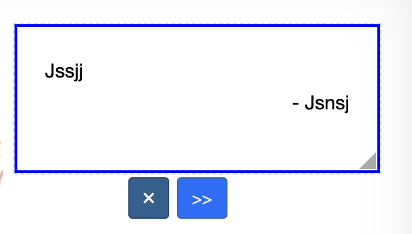
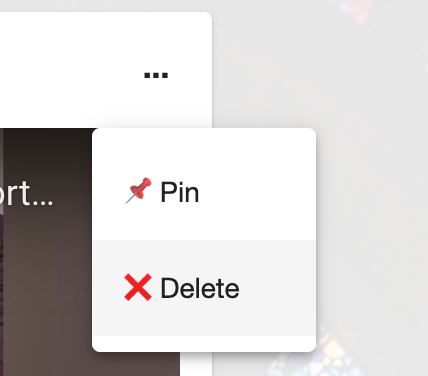

# Delete a message

It's easy. A message creator (i.e. the signer) can delete their message. The card / board creator can delete any messages.

## Greeting Card

Click on a message a hit the 'x' button:

## Board

Click on top-right of a message, and hit 'Delete' option:

