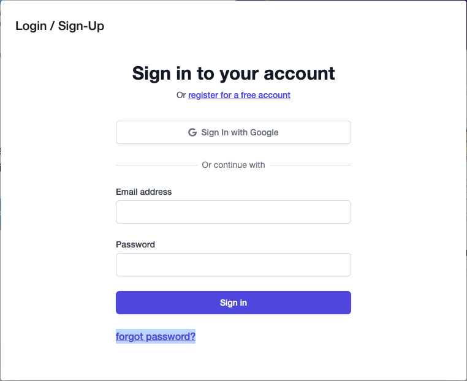

# How to reset Password

It's easy to reset a password.

## Case 1. You forgot your password.

Click on 'Login', and then click on 'Forgot password', and follow the prompts.

## Case 2. You forgot your email.

If you're already logged in, you can go to your Dashboard -> My Account -> Email, and reset your email.

If you aren't already logged in, you can create a new account with a new email.